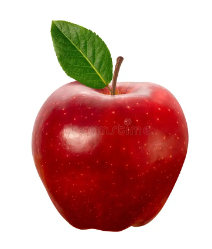
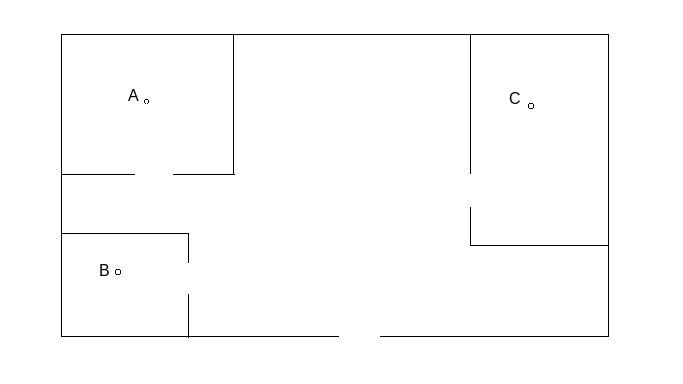
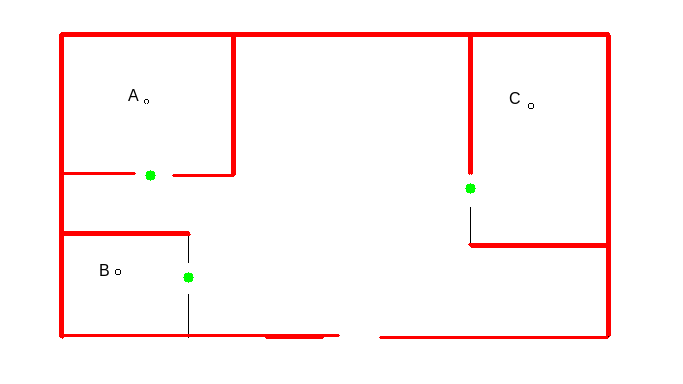

# Directory Structure and Files
This directory contains some code for exploring LLMs for navigation without 
using ROS. Specifically, five different approaches were established: 

1. Instruct an LLM on where the robot should go and receive the final position 
and orientation of the robot. This is basically the code provided by Alaa.

2. Load simple image of an apple into a LLM

[//]: # (![Alt text]&#40;apple.png&#41;)



3. Load a Bird's Eye View (BEV) image of a room and ask the LLM to describe the 
coordinates (in pixels) of walls and doors



4. Provide the same BEV image and ask the LLM to instruct the robot on how to get
to point A from the entrance without any prior information


5. Provide the same BEV image, use OpenCV to extract doors and walls (green and 
red respectively), pass these points of interest to the LLM and then obtain 
a path to go from 
    - From Entrance to A
    - From Entrance to B
    - From B to C

The OpenCV resulting image is shown below:




## General Comment

Note, the files described here generally follow a similar structure, with 
the main difference being the type of input to the LLM or the image description. 
Besides that, the general steps are:

1. Initialise the processor and model for image description. The `BlipProcessor, 
BlipForConditionalGeneration` are used for this purpose, and are established as 
global variables.
2. Create a function for getting an image description. The description of the 
image may be passed to the LLM.
3. Initialise the LLM (provided by Alaa, no changes made) using the key. **Note**, 
a function `load_key()` in "helper_functions/load_key_from_txt.py" can be used 
to import the key from "key/key.txt" directly instead of having to change the key 
in each file. **THIS WAY, WE CAN PUSH TO GITHUB WITHOUT ERRORS SINCE THE Key.txt 
WAS ADDED TO GITIGNORE**.
4. Create a prompt template. The template is the most important part, as it needs to be 
as descriptive as possible when asking the LLM to provide a result/inference. 
This is also where you can **mention** any additional data (e.g. locations of doors) 
to the model.
5. Create an instance of LLMChain, which is basically the model **with** the 
prompt template. 
6. Set up any further inputs required. For example, if doors were mentioned in 
the prompt template, this is where you actually pass the coordinates of the doors.
7. Provide a command and run the chain. Basically here you say "go to point B", 
and the model should respond accordingly.


## Basic Robot Coordinates
This is Alaa's code, just without using ROS. Here, no images are involved, and 
you can make a request for the LLM to provide you with the position and orientation 
of the robot after commanding it to go to a specific location. Note, compounding 
commands (e.g. Go to point A, then point B, then point C) seems to have a weird 
effect on the Z-orientation of the robot.

## Simple Image Loader
In order to load a simple image you can run the file:

```
load_image_llm.py
```

This is the most standard example of image loading in LLM, and will just provide 
a description of the image of the apple. 

## Describe a BEV Image
For this, you can use the file:

```
image_input.py
```

The purpose of this code was to load the BEV in the LLM, provide the coordinates 
of points A and B and request the model to provide the coordinates of point C. 
However, this is a great example of how inadequate standard LLMs are at 
navigating even simple images of maps, as the model obtains a terrible 
description for the image and is hence unable to provide an answer. **Ultimately, 
this code will run but fail to give a result**.


## Request BEV-based Robot Path
This is achieved using:

```
image_estimate_robot_path.py
```

This file involves us providing the LLM with the coordinates of A, B, C and the 
image, and then asking the LLM to give us a path to move between these points. 
However, The image is effectively unused in the end, because the model cannot 
locate the walls/doors and therefore provides a path between points without 
taking into account the obstacles.

## Manually Provide Obstacles
Since the model is unable to extract obstacles or entrances from the image, you 
can use:

```
image_estimate_walls_path.py
```

In this file, the BEV image is passed through some OpenCV functions to extract 
the walls and doors and generate "output_image.png". These extracted points of 
interest are then fed into the model as numbers. Finally, three requests are made, 
specifically "move from Entrance to A", "move from Entrance to B", and "move 
from B to C". This is also a good example on how to provide more than one 
commands in the same model without needing any re-initialising. Note, the function 
for extracting walls and doors using OpenCV is not very well tuned, it is just 
experimental and therefore some walls are not included, as seen by the edges 
that are not red in "ouput_image.png".

## General comments
Note, `image_estimate_walls_path_coordinates.py` is not working and you can 
disregard it. 

